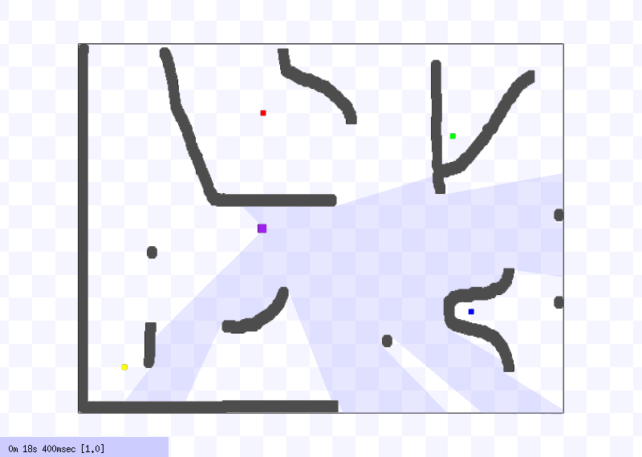

# stage_ros_robot_controller

[ROS](https://www.ros.org/) stage simulator code example to control a robot to reach a determined target avoiding obstacles using a laser sensor (LiDAR) of 270 degree range on a Hokuyo map.

  

## Built with:

<ul>
  <li>ROS</li>
  <li>Python 3</li> 
</ul>

## Getting Started

### File Tree

<ul class="tree">
    <li class="folder">
        catkin_ws
        <ul>
            <li class="folder">
                build
            </li>
            <li class="folder">
                devel
            </li>
            <li class="folder">
                source
                <ul>
                    <li>stage_controller</li>
                </ul>
            </li>
        </ul>
    </li>

<link rel="stylesheet" href="http://files.cod3r.com.br/curso-web/tree.css">
